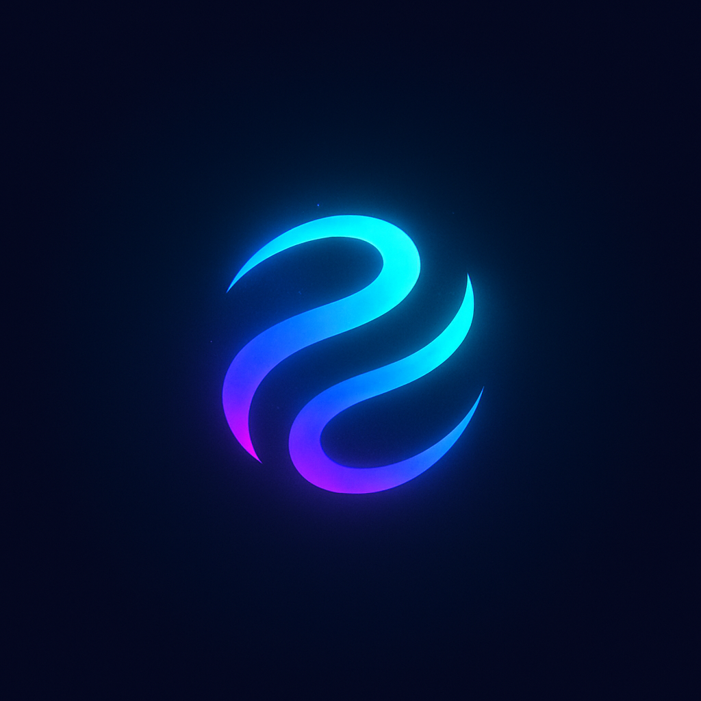

# DreamRender

Transform your images into stunning, AI-generated artistic variations with ease. This web app leverages advanced AI models to create multiple stylized versions of your uploaded image, delivering results directly to your inbox.

**Now with Ad Graphics Generation!** Instantly create high-conversion ad graphics for your business, startup, or marketing campaigns using AI.

---

## 🚀 Features

- **AI-Powered Image Transformation**: Upload an image or provide a URL to generate unique style variations.
- **Ad Graphics Generation**: Generate professional, conversion-optimized ad graphics with custom headlines, CTAs, and even founder images.
- **Multiple Variations**: Choose how many styles (1-10) you want for each image or ad.
- **Quality Selection**: Select from high, medium, or low quality for faster or more detailed results (for art variations).
- **Instant Preview**: See the first variation instantly in the app.
- **Email Delivery**: Receive a Google Drive download link for all variations or ad graphics in your email.
- **Modern UI**: Built with React, shadcn-ui, and Tailwind CSS for a beautiful, responsive experience.

---

## 📸 How It Works

### For Art Variations
1. **Upload** your image (or paste an image URL).
2. **Select** the number of variations and desired quality.
3. **Enter** your email address.
4. **(Optional)** Add style notes for custom results.
5. **Submit** the form and let the AI work its magic!
6. **Preview** the first result instantly and get all variations via email.

### For Ad Graphics Generation
1. **Fill** in your ad details (headline, subheading, key points, CTA, button text, etc.).
2. **Upload** an image (optional, e.g., founder photo).
3. **Select** the number of ad variations and resolution (square, portrait, landscape).
4. **Enter** your email address.
5. **Submit** and let the AI generate high-conversion ad graphics!
6. **Preview** your ad instantly and get all variations via email.

---

## 🛠️ Tech Stack

- [React](https://react.dev/)
- [TypeScript](https://www.typescriptlang.org/)
- [Vite](https://vitejs.dev/)
- [shadcn/ui](https://ui.shadcn.com/)
- [Tailwind CSS](https://tailwindcss.com/)
- [Radix UI](https://www.radix-ui.com/)
- [Google Drive API] (for file delivery)
- [n8n](https://n8n.io/) (for backend automation)

---

## 🖥️ Local Development

### Prerequisites
- [Node.js](https://nodejs.org/) (v18+ recommended)
- [npm](https://www.npmjs.com/) or [bun](https://bun.sh/) or [yarn](https://yarnpkg.com/)

### Getting Started

```sh
# Clone the repository
git clone <YOUR_GIT_URL>
cd <YOUR_PROJECT_NAME>

# Install dependencies
npm install

# Start the development server
npm run dev
```

The app will be available at [http://localhost:5173](http://localhost:5173) (or as shown in your terminal).

---

## 📦 Build for Production

```sh
npm run build
```
The output will be in the `dist/` folder. You can preview the production build with:
```sh
npm run preview
```

---

## 🤝 Contributing

Contributions, issues, and feature requests are welcome! Feel free to open an issue or submit a pull request.

---

## 📄 License

This project is licensed under the MIT License. See [LICENSE](LICENSE) for details.

---

## 🙏 Acknowledgements

- [shadcn/ui](https://ui.shadcn.com/)
- [Radix UI](https://www.radix-ui.com/)
- [n8n](https://n8n.io/)
- [Google Drive]

---

> Made with ❤️ for creative minds.
